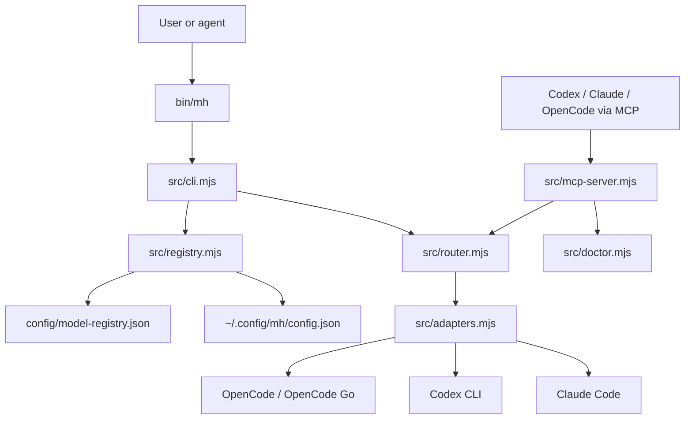
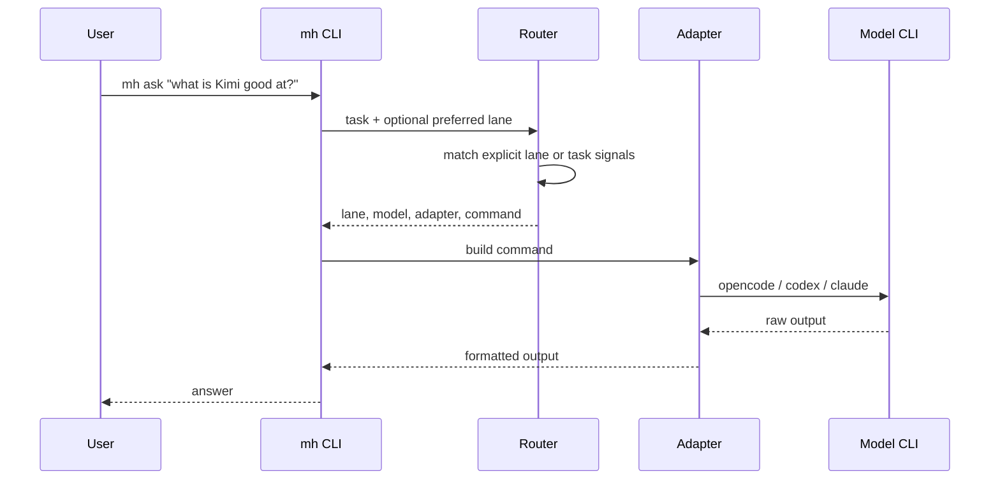

# model-harness

`mh` is a local daily-driver model harness for rotating work across OpenCode/OpenCode Go models, Codex, and Claude from one command surface.

It is built for a practical workflow: cheap and fast models handle routine questions, Kimi/DeepSeek/Grok-style lanes handle coding and exploration, and Codex or Claude stay available as higher-trust escalation lanes for review, architecture, and risky repo work.

## Why This Exists

Modern coding agents are strongest when they can choose the right model for the job instead of forcing every task through one default assistant. `mh` gives you a small, inspectable router on your machine:

- Ask cheap questions without burning premium reasoning budget.
- Route coding work to Kimi, DeepSeek, Grok, or other OpenCode-compatible models.
- Keep Codex and Claude as explicit escalation paths for review, architecture, and careful refactors.
- Expose the same router to other agents through MCP so Codex, Claude, or OpenCode can ask `mh` for read-only help.
- Override the model registry locally without changing source code.

## Architecture



The important boundary is the registry. Models, lanes, fallbacks, costs, and aliases live in JSON, while the router stays deterministic and easy to inspect. That lets the harness evolve as providers change without rewriting the CLI.

For the deeper architecture writeup, see [docs/architecture.md](docs/architecture.md).

## Routing Flow



## Default Lanes

| Command | Default target | Intended use |
| --- | --- | --- |
| `mh ask` | `deepseek_flash` | Cheap general questions |
| `mh cheap` | `deepseek_flash` | Low-stakes coding, summaries, triage |
| `mh free` | `openrouter_free` | Free OpenCode lane |
| `mh kimi` | `kimi_k27_code` | Kimi coding and long-horizon implementation |
| `mh deepseek` | `deepseek_flash` | Fast DeepSeek lane |
| `mh deepseek-pro` | `deepseek_pro` | Harder DeepSeek reasoning when provider access is enabled |
| `mh code` | `grok_build` | Multi-file implementation lane |
| `mh grok` | `grok_latest` | Grok reasoning or knowledge work |
| `mh gemini` | `gemini_flash_latest` | Visual/document lane placeholder, currently mapped to Qwen3.7 Plus through OpenCode Go |
| `mh codex` | `codex_exec` | Codex execution escalation |
| `mh hard` | `codex_exec` | High-trust hard task escalation |
| `mh review` | `codex_review` | Uncommitted change review |
| `mh claude` | `claude_sonnet` | Planning, architecture, careful refactors |

The lane names are stable on purpose. You can remap a lane from Kimi to another provider, or from a free DeepSeek model to a paid one, without changing the way you call `mh`.

## Setup

Install dependencies:

```sh
npm install
```

Make `mh` globally available:

```sh
npm link
```

Connect OpenCode to OpenCode Go, OpenRouter, or another provider:

```sh
opencode
/connect
opencode auth list
```

Optional local overrides:

```sh
mkdir -p ~/.config/mh
cp config/config.example.json ~/.config/mh/config.json
```

Run diagnostics:

```sh
mh doctor --json
```

## Usage

```sh
mh help
mh models --json
mh route --json "review this diff for security issues"
mh brain --dry-run "fix the failing tests"
mh ask "what is the difference between Kimi and DeepSeek for coding?"
mh kimi "sketch the implementation plan for this parser"
mh review "review uncommitted changes"
```

Use `--dry-run` to inspect the selected lane and command without making a live model call.

## Agent Integration

`mh` can run as an MCP server so other agents can route through it:

```sh
codex mcp add mh -- /Users/toyea/Desktop/model-harness/bin/mh mcp serve
claude mcp add mh -- /Users/toyea/Desktop/model-harness/bin/mh mcp serve
opencode mcp add mh -- /Users/toyea/Desktop/model-harness/bin/mh mcp serve
```

MCP tools:

- `mh_help`
- `mh_list_models`
- `mh_route_task`
- `mh_delegate_task`
- `mh_review`
- `mh_doctor`

## Safety Defaults

MCP delegation is read-only in v1.

- `mh_delegate_task` refuses `allowWrites: true`.
- MCP calls to Codex and Claude are blocked unless `allowRecursiveEscalation` is explicitly true.
- Delegated OpenCode calls use the `explore` agent.
- Tool results redact common API-token patterns.

The human CLI can still call Codex, Claude, or OpenCode directly. The tighter rules apply to agent-to-agent delegation, where recursion and accidental writes are the main risks.

## Configuration

Built-in defaults live in [config/model-registry.json](config/model-registry.json). Personal overrides live at:

```sh
~/.config/mh/config.json
```

Example:

```json
{
  "defaultCommand": "brain",
  "budget": "balanced",
  "lanes": {
    "cheap": "deepseek_flash",
    "code": "kimi_k27_code",
    "review": "codex_review"
  },
  "modelOverrides": {
    "deepseek_flash": {
      "fallbacks": ["gemini_flash_latest"]
    }
  }
}
```

## Roadmap

- Budget-aware routing, so `mh brain` can choose between cheap, balanced, and quality policies.
- Provider health checks and automatic fallback when a model fails.
- First-class Gemini and Grok provider adapters when those local credentials are connected.
- Better trace logging for why a model was selected.
- Optional write-capable MCP mode with explicit per-task approval.

## Verify

```sh
npm test
mh help
mh models --json
mh route --json "analyze this screenshot and suggest UI fixes"
mh brain --dry-run "fix the failing tests"
mh doctor --json
```
