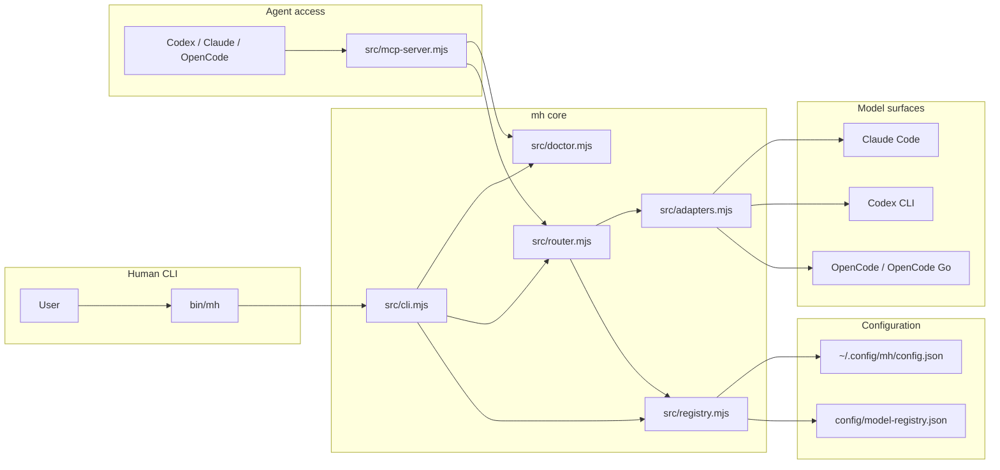
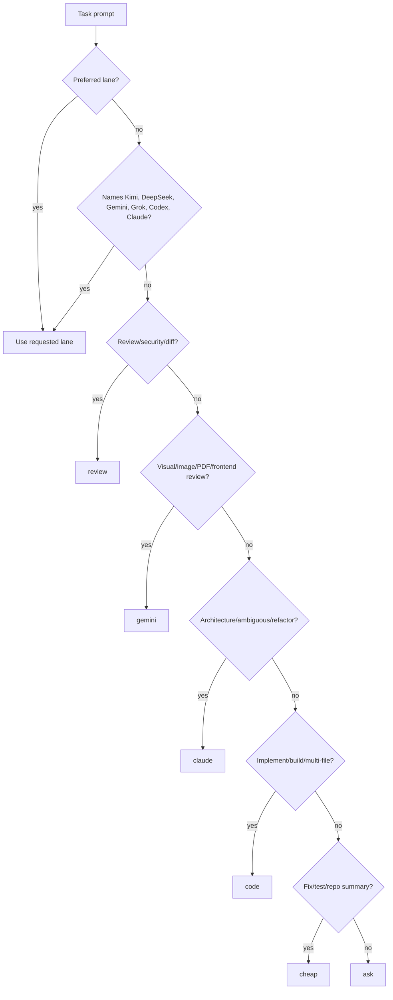
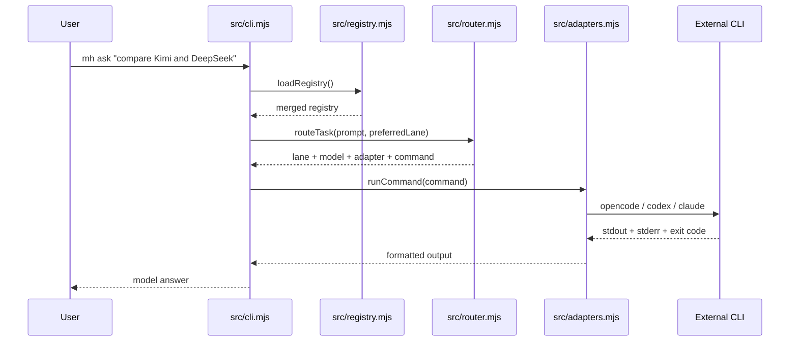
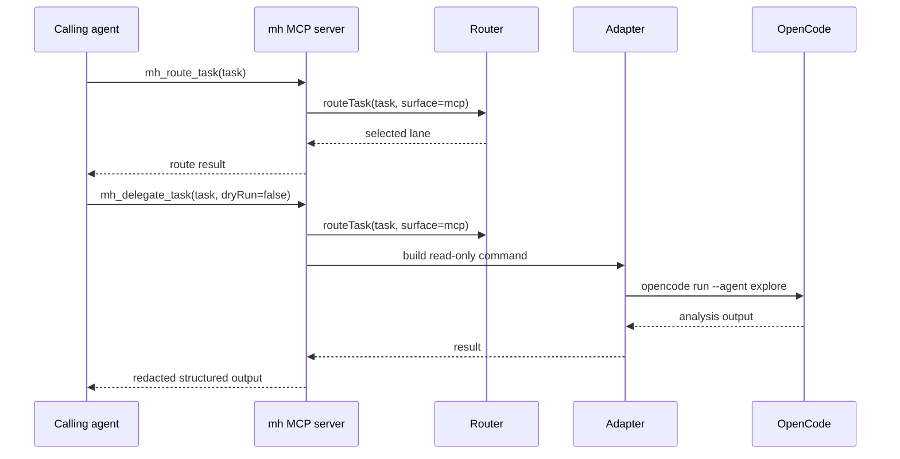

# model-harness architecture

`mh` is intentionally small: a command-line entrypoint, a JSON model registry, a deterministic router, adapter wrappers around external CLIs, and an MCP server for agent access.

## System Flow



## Component Responsibilities

| Component | Responsibility |
| --- | --- |
| `bin/mh` | Stable executable wrapper for global use. |
| `src/cli.mjs` | Parses commands, loads the registry, prints routes, and runs selected commands. |
| `src/registry.mjs` | Loads built-in models, merges user overrides, and validates lanes, aliases, adapters, and fallbacks. |
| `config/model-registry.json` | Declares models, lanes, capabilities, cost tiers, and command aliases. |
| `src/router.mjs` | Chooses a lane from an explicit command or deterministic task signals. |
| `src/adapters.mjs` | Builds and runs external `opencode`, `codex`, and `claude` commands. |
| `src/mcp-server.mjs` | Exposes the harness to agents through MCP tools. |
| `src/doctor.mjs` | Checks local CLIs, registry health, and OpenCode auth state. |

## Routing Decision

The router follows a predictable ladder:

1. If the user called a specific command, use that lane. Example: `mh kimi`.
2. If the prompt explicitly names a model family, use that lane. Example: "use deepseek pro".
3. If the prompt contains review or security signals, use `review`.
4. If it contains screenshot, image, PDF, visual, or frontend-review signals, use `gemini`.
5. If it contains architecture or careful-refactor signals, use `claude`.
6. If it contains implementation or build signals, use `code`.
7. If it looks like routine test, fix, or repo-summary work, use `cheap`.
8. Otherwise, use `ask`.



## CLI Execution Flow



## MCP Execution Flow

MCP is designed as a read-only delegation surface. A calling agent should inspect routing first, then delegate only when the selected lane is acceptable.



## Model Registry Shape

Each model entry declares the adapter, provider model id, capabilities, cost tier, context window, fallback list, and write policy.

```json
{
  "models": {
    "kimi_k27_code": {
      "adapter": "opencode",
      "model": "opencode-go/kimi-k2.7-code",
      "capabilities": ["agentic_coding", "coding", "reasoning", "tool_use"],
      "costTier": "medium",
      "fallbacks": ["deepseek_flash"],
      "allowAgentWrites": false
    }
  },
  "lanes": {
    "kimi": "kimi_k27_code"
  },
  "commandAliases": {
    "kimi": "kimi"
  }
}
```

Local config can override the lane target, extend the model table, or patch a built-in model:

```json
{
  "lanes": {
    "code": "kimi_k27_code"
  },
  "modelOverrides": {
    "deepseek_flash": {
      "fallbacks": ["qwen_plus"]
    }
  }
}
```

## Current Defaults

| Lane | Model id | Adapter | Cost tier |
| --- | --- | --- | --- |
| `ask` | `deepseek_flash` | `opencode` | `free` |
| `cheap` | `deepseek_flash` | `opencode` | `free` |
| `free` | `openrouter_free` | `opencode` | `free` |
| `kimi` | `kimi_k27_code` | `opencode` | `medium` |
| `deepseek` | `deepseek_flash` | `opencode` | `free` |
| `deepseek_pro` | `deepseek_pro` | `opencode` | `medium` |
| `code` | `grok_build` | `opencode` | `medium` |
| `grok` | `grok_latest` | `opencode` | `high` |
| `gemini` | `gemini_flash_latest` | `opencode` | `medium` |
| `codex` | `codex_exec` | `codex` | `subscription` |
| `hard` | `codex_exec` | `codex` | `subscription` |
| `review` | `codex_review` | `codex` | `subscription` |
| `claude` | `claude_sonnet` | `claude` | `subscription` |

The `gemini` lane is currently a lane placeholder mapped to Qwen3.7 Plus through OpenCode Go. Once Gemini credentials are connected through a supported provider, that lane can be remapped without changing CLI usage.

## Safety Model

The harness separates human-triggered execution from agent-triggered delegation.

Human CLI:

- Can run selected external CLIs directly.
- Can call Codex, Claude, OpenCode, Kimi, DeepSeek, Grok, or other mapped lanes.
- Uses `--dry-run` to inspect routing before execution.

MCP:

- Refuses `allowWrites: true`.
- Uses `opencode run --agent explore` for OpenCode delegation.
- Blocks recursive Codex or Claude escalation unless `allowRecursiveEscalation` is explicitly true.
- Redacts common API token patterns from tool results.

## Extension Points

Add a new provider model:

1. Add a model entry under `models`.
2. Point a lane to it under `lanes`.
3. Add or update a command alias under `commandAliases`.
4. Run `mh doctor --json`.
5. Run `mh route --json "<task>"` to inspect routing.

Add a new adapter:

1. Add the adapter name to `validAdapters` in `src/registry.mjs`.
2. Implement command construction in `src/adapters.mjs`.
3. Decide whether it supports MCP read-only delegation in `supportsMcpReadOnly`.
4. Add routing and CLI tests.

Tune `mh brain`:

- Update `src/router.mjs` signal rules.
- Add cost-aware or budget-aware logic.
- Extend tests in `test/router.test.mjs`.
- Keep the route output explainable so model selection remains debuggable.

## Verification Commands

```sh
npm test
mh help
mh models --json
mh route --json "analyze this screenshot and suggest UI fixes"
mh brain --dry-run "fix the failing tests"
mh doctor --json
```
